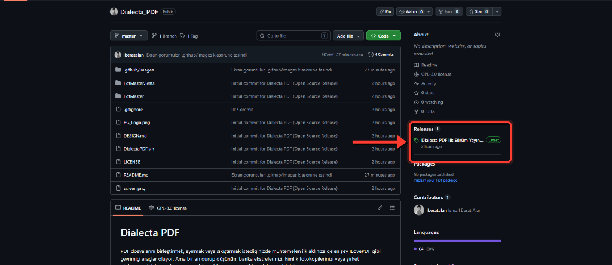

# Dialecta PDF

PDF dosyalarını birleştirmek, ayırmak veya sıkıştırmak istediğinizde muhtemelen ilk aklınıza gelen şey ILovePDF gibi çevrimiçi araçlar oluyor. Ama bir an durup düşünün: banka ekstrelerinizi, kimlik fotokopilerinizi veya şirket sözleşmelerinizi gerçekten tanımadığınız bir sunucuya yüklemek ister misiniz?

Dialecta PDF bu soruya "hayır" diyenler için yazıldı. Tamamen çevrimdışı çalışan, dosyalarınızı hiçbir sunucuya göndermeyen, ücretsiz ve açık kaynaklı bir Windows masaüstü uygulamasıdır. Kurulum bile gerektirmez; tek bir `.exe` dosyasını çalıştırmanız yeterli.

Kaynak kodun tamamı bu depoda yer alıyor. Arka planda ne döndüğünü merak ediyorsanız kendiniz inceleyebilir, fork'layabilir veya katkıda bulunabilirsiniz.

---

## Nasıl kullanırım?

Uygulamayı kullanmak için herhangi bir kurulum yapmanıza gerek yok. Bu sayfanın sağ tarafındaki **Releases** bölümünden en güncel sürümü `.zip` olarak indirin, arşivi açın ve içindeki `DialectaPDF.exe` dosyasını çalıştırın. Hepsi bu kadar.



Eğer kaynak koddan kendiniz derlemek isterseniz, sayfanın alt kısmındaki [Kurulum ve derleme](#kurulum-ve-derleme) bölümüne bakabilirsiniz.

---

## Ne yapabilirsiniz?

### PDF Birleştirme
Birden fazla PDF dosyasını sürükleyip bırakarak istediğiniz sırayla tek bir belgede birleştirin.


### PDF Ayırma
Bir belgeyi sayfa aralıklarına göre parçalara bölün ya da her sayfayı ayrı bir dosya olarak kaydedin.


### Sayfa Düzenleme ve Döndürme
Sayfaları görsel ızgara üzerinde sürükleyerek yeniden sıralayın, döndürün veya istemediğiniz sayfaları çıkarın.


### Görüntüden PDF Oluşturma
Görsel dosyalarınızı seçin, tek tıkla PDF'e dönüştürün.


### PDF Sıkıştırma
Dosya boyutunu düşük, orta veya yüksek sıkıştırma seviyeleriyle küçültün. E-postayla gönderilemeyecek kadar büyük belgeler için ideal.


### Filigran Ekleme
Sayfalarınıza metin veya logo filigranı ekleyin. Saydamlık, açı ve konum ayarlarını kendiniz belirleyin.


### Hassas Veri Karartma
TCKN, telefon numarası veya istediğiniz herhangi bir anahtar kelimeyi belgede kalıcı olarak karartın. Karartılan veriler geri getirilemez.


### Yerel OCR (Metin Tanıma)
Taranmış belgelerden veya görsellerden metin çıkarın. Dahili Tesseract motoru Türkçe ve İngilizce destekler. İnternet bağlantısı gerekmez, her şey bilgisayarınızda işlenir.


### Dijital Mühür ve İmza
Belgelerinize görsel imza veya kaşe ekleyin. Uygulama arka planda SHA-256 özeti oluşturarak belgenin değiştirilip değiştirilmediğini doğrulamanıza olanak tanır.


### Denetim Günlüğü ve Yedekleme
Yaptığınız tüm işlemler zaman damgasıyla birlikte kayıt altına alınır. Tüm verilerinizi tek tıkla ZIP olarak yedekleyebilirsiniz.


---

## Güvenlik ve gizlilik

Uygulamanın güvenlik konusundaki yaklaşımı oldukça basit: hiçbir şey dışarı çıkmaz.

- Hiçbir dış sunucuya bağlanmaz, hiçbir veri göndermez, telemetri toplamaz.
- Orijinal dosyalarınıza dokunmaz. Her işlem yeni bir çıktı dosyası üretir.
- Programı kapattığınızda hiçbir arka plan süreci kalmaz.
- Tüm çıktılar ve kayıtlar yerel `DialectaPDF_Veri` klasöründe saklanır.

> **Not:** Uygulamadaki dijital mühür özelliği kişisel kullanım içindir. 5070 sayılı Elektronik İmza Kanunu kapsamındaki nitelikli e-imza (NES) yerine geçmez.

---

## Kurulum ve derleme

Projeyi klonlayıp terminalden derleyebilirsiniz:

```powershell
dotnet build
```

Tek dosya olarak dağıtmak isterseniz (hedef makinede .NET kurulu olması gerekmez):

```powershell
dotnet publish PdfMaster/PdfMaster.csproj -c Release -r win-x64 --self-contained true -p:PublishSingleFile=true -p:IncludeNativeLibrariesForSelfExtract=true -p:EnableCompressionInSingleFile=true -o ./publish
```

Oluşan `publish/DialectaPDF.exe` dosyasını herhangi bir Windows bilgisayara kopyalayıp çalıştırabilirsiniz.

---

## Teknik mimari

Uygulama **.NET 8 (WPF)** üzerine klasik **MVVM (Model–View–ViewModel)** deseniyle inşa edilmiştir. Üçüncü parti MVVM framework kullanılmaz; `INotifyPropertyChanged`, `RelayCommand` gibi altyapılar elle yazılmıştır.

```
┌─────────────────────────────────────────────────────┐
│                     Views (XAML)                     │
│  MergeView · SplitView · CompressView · OcrView … │
├─────────────────────────────────────────────────────┤
│                    ViewModels (C#)                   │
│  MergeVM · SplitVM · CompressVM · OcrVM …          │
├─────────────────────────────────────────────────────┤
│                   Services (C#)                      │
│  PdfMergeService · PdfCompressService · …          │
│  StorageManager · AuditLogger · SecurityAndHash     │
├─────────────────────────────────────────────────────┤
│                    Models (C#)                       │
│  AuditEvent · OperationResult · WatermarkOptions …│
└─────────────────────────────────────────────────────┘
```

- **Views** yalnızca XAML arayüz tanımlarını barındırır; code-behind dosyaları neredeyse boştur.
- **ViewModels** kullanıcı etkileşimlerini yönetir ve ilgili servisi çağırır.
- **Services** tüm iş mantığını içerir. Her servis tek bir PDF işleminden sorumludur (Single Responsibility).
- **StorageManager** singleton deseniyle dosya yönetimini (orijinal yedekleme, versiyonlu çıktı, yedek ZIP) merkezileştirir.
- **AuditLogger** her işlemi zaman damgası, SHA-256 özeti ve süre bilgisiyle JSONL formatında kaydeder.

---

## Kullanılan teknolojiler ve kütüphaneler

| Kütüphane | Sürüm | Kullanım Alanı |
|---|---|---|
| **.NET 8 (WPF)** | 8.0 | Uygulama çatısı ve arayüz |
| **PdfSharpCore** | 1.3.67 | Birleştirme, ayırma, sayfa düzenleme, döndürme, filigran, imza ve karartma |
| **iText 7** | 9.7.0 | Bozuk PDF onarımı (cross-reference table yeniden yazma) ve sayfa sayısı okuma |
| **UglyToad.PdfPig** | 1.7.0 | Metin çıkarma (kelime bazında koordinat + bounding box), sayfa boyutu hesaplama |
| **Docnet.Core** | 2.6.0 | PDF sayfalarını piksel dizisine (BGRA bitmap) dönüştürme |
| **Tesseract OCR** | 5.2.0 | Taranmış belgelerden optik karakter tanıma (Türkçe + İngilizce) |
| **Ghostscript.NET** | 1.3.5 | PDF sıkıştırma (görüntü downsampling ve stream optimizasyonu) |
| **System.Drawing.Common** | 10.0.11 | EXIF oryantasyon düzeltme (görüntüden PDF oluşturma) |

---

## Algoritmalar ve teknik detaylar

### Sıkıştırma motoru

Sıkıştırma işlemi Ghostscript PostScript yorumlayıcısı üzerinden çalışır. PDF belgesi dahili olarak yeniden işlenir ve gömülü görüntüler belirtilen DPI hedefine göre yeniden örneklenir:

| Seviye | PDF Preset | Hedef DPI | Downsampling Algoritması |
|---|---|---|---|
| Düşük (kaliteli) | `/printer` | 300 | Bicubic |
| Orta (dengeli) | `/ebook` | 150 | Average |
| Yüksek (küçük boyut) | `/screen` | 72 | Subsample |

Çok çekirdekli işlemci desteği etkindir; `dNumRenderingThreads` parametresi `Environment.ProcessorCount - 1` olarak ayarlanır. Çıktı PDF 1.4 uyumluluğuyla üretilir.

### OCR (Optik Karakter Tanıma)

OCR işlemi iki aşamalı bir pipeline ile gerçekleştirilir:

1. **Rasterizasyon:** Docnet.Core kütüphanesi PDF sayfasını 4× ölçekle BGRA piksel dizisine dönüştürür.
2. **Ön İşleme:** WPF `FormatConvertedBitmap` ile BGRA → Gray8 renk uzayı dönüşümü yapılır; bu, Tesseract'ın tanıma doğruluğunu artırır.
3. **Tanıma:** Tesseract motoru `EngineMode.Default` modunda (LSTM + Legacy) çalışır. Her sayfa bağımsız olarak işlenir ve güven oranı (`MeanConfidence`) hesaplanır.

Bellek yönetimi için her 5 sayfada bir `GC.Collect()` çağrılır. Tesseract dil modelleri (`tessdata/`) uygulama dizinine gömülüdür; internet bağlantısı gerekmez.

### Hassas veri karartma (Redaction)

Karartma iki farklı kaynak üzerinden çalışır:

- **Manuel seçim:** Kullanıcının arayüzde çizdiği dikdörtgen koordinatları doğrudan PDF sayfasına uygulanır.
- **Anahtar kelime arama:** UglyToad.PdfPig kütüphanesi ile kelime bazında metin çıkarılır. Her kelimenin `BoundingBox` koordinatları alınır ve PDF'in koordinat sistemiyle uyumlu hale getirilir (Y ekseni dönüşümü: `pageHeight - top`). Eşleşen kelimelerin etrafına ±2pt tolerans eklenerek karartma dikdörtgeni oluşturulur.

Karartma işlemi kalıcıdır: PdfSharpCore ile `XGraphics.Append` modunda opak bir dikdörtgen çizilir. Alttaki metin verisine ulaşılamaz hale gelir.

### Dijital mühür ve bütünlük doğrulama

Uygulama kriptografik bütünlük doğrulaması için **SHA-256** kullanır:

1. İşlem öncesi kaynak dosyanın SHA-256 özeti hesaplanır.
2. İşlem sonrası çıktı dosyasının SHA-256 özeti hesaplanır.
3. Her iki özet de denetim günlüğüne kaydedilir.

Mühür kutusu PDF sayfasına vektörel olarak çizilir (rounded rectangle, başlık, imzalayan bilgisi, zaman damgası, kısaltılmış SHA-256 özeti). İmza görseli varsa `XImage` olarak mühür kutusunun sağ tarafına yerleştirilir.

### Paralel işleme stratejisi

Dosya I/O yoğun işlemler (birleştirme ön hazırlığı, ayırma, görüntü dönüştürme, sayfa render) `Parallel.For` / `Parallel.ForEach` ile çok çekirdekli olarak yürütülür. Maksimum thread sayısı `Environment.ProcessorCount × 0.75` olarak sınırlanır; böylece kullanıcı arayüzü donmaz ve sistemin geri kalanı kullanılabilir kalır.

### Depolama ve versiyon yönetimi

`StorageManager` singleton'u şu klasör yapısını yönetir:

```
DialectaPDF_Veri/
├── Orijinaller/    ← Kaynak dosyanın SHA-256 kısa özetli kopyası (ReadOnly)
├── Ciktilar/       ← Zaman damgalı versiyonlu çıktılar
├── Yedekler/       ← Tek tıkla ZIP yedekleri
└── denetim_kayitlari.jsonl  ← JSONL formatında denetim günlüğü
```

Dosya isimleri `{orijinal_ad}_{işlem}_{tarih_saat}.pdf` şablonuyla üretilir. Aynı saniyede birden fazla çıktı üretilirse sayaç eklenir.

### EXIF oryantasyon düzeltme

Görüntüden PDF oluşturulurken JPEG/PNG dosyalarının EXIF Tag `0x0112` (Orientation) değeri okunur. 8 farklı oryantasyon durumu `RotateFlip` ile düzeltilir ve EXIF etiketi kaldırılır. Bu sayede mobil cihazdan çekilen fotoğraflar doğru yönde PDF'e aktarılır.

### Bozuk PDF otomatik onarımı

PdfSharpCore'un ayrıştıramadığı bozuk cross-reference tablosu (`XRef table`) hatalarında iText 7 devreye girer. iText, PDF'i okuyup yeniden yazarak çapraz referans tablosunu yeniden oluşturur. Onarılmış geçici dosya işlem tamamlandıktan sonra silinir.

---

## Karşılaşılan büyük problemler ve çözümleri

### 1. Bozuk PDF dosyaları ve XRef tablosu hataları

**Problem:** Farklı PDF üreticileri (eski tarayıcılar, bazı web araçları) standart dışı veya bozuk cross-reference tabloları oluşturuyor. PdfSharpCore bu dosyaları ayrıştıramayıp çöküyor.

**Çözüm:** İki kademeli hata yakalama mekanizması uygulandı. `XRef` veya `cross-reference` içeren exception'larda önce `PdfRepairService` aracılığıyla iText 7'nin toleranslı parser'ı kullanılarak dosya onarılıyor. Onarım da başarısız olursa kullanıcıya "Chrome'da açıp PDF olarak yazdır" gibi anlaşılır bir alternatif sunuluyor.

### 2. OCR bellek tüketimi

**Problem:** Yüksek çözünürlüklü, çok sayfalı belgelerde her sayfa BGRA bitmap'e dönüştürüldüğünde bellek tüketimi hızla artıyordu; 50+ sayfalık belgelerde `OutOfMemoryException` oluşuyordu.

**Çözüm:** Her 5 sayfada bir `GC.Collect()` + `GC.WaitForPendingFinalizers()` çağrısı eklendi. Proje seviyesinde `ServerGarbageCollection=false`, `ConcurrentGarbageCollection=true` ve `HeapHardLimit=8GB` ayarlandı. BGRA → Gray8 dönüşümü hem Tesseract'ın doğruluğunu artırdı hem de bellek kullanımını dörtte bire düşürdü.

### 3. Ghostscript DLL dağıtımı

**Problem:** Ghostscript.NET, sisteme yüklü Ghostscript'i arıyor. Ama uygulamanın kurulum gerektirmeden çalışması hedeflendiği için `gsdll64.dll` dosyasının portable olarak dağıtılması gerekiyordu.

**Çözüm:** `gsdll64.dll` uygulama dizinine (`Assets/Ghostscript/`) gömüldü ve `GhostscriptVersionInfo` nesnesi doğrudan DLL yolu verilerek oluşturuldu. Build sırasında `CopyToOutputDirectory=PreserveNewest` ile çıktıya otomatik kopyalanıyor.

### 4. PDF koordinat sistemi uyumsuzlukları

**Problem:** PDF standartında Y ekseni sol alt köşeden başlar (yukarı doğru artar). Ancak WPF ve çoğu ekran sistemi sol üst köşeden başlar. Karartma ve filigran koordinatları ters çıkıyordu.

**Çözüm:** UglyToad.PdfPig'in döndürdüğü `BoundingBox.Top` değeri `pageHeight - top` formülüyle dönüştürüldü. Her karartma dikdörtgenine ±2pt tolerans eklenerek metin kaplamasındaki hassasiyet sorunları giderildi.

### 5. EXIF oryantasyonlu görüntüler

**Problem:** Mobil cihazlardan çekilen fotoğraflar piksel verisi olarak yatay kaydedilip EXIF tag ile döndürülmüş olarak işaretleniyor. PDF'e aktarıldığında görseller yanlış yönde görünüyordu.

**Çözüm:** `System.Drawing.Image` ile EXIF tag `0x0112` okunarak 8 farklı oryantasyon durumu (`RotateFlip` enum) ile düzeltilip tag kaldırılıyor. Düzeltilmiş görsel `MemoryStream` üzerinden PdfSharpCore'a aktarılıyor.

### 6. Çoklu kütüphane çakışmaları

**Problem:** Proje aynı anda PdfSharpCore, iText 7, UglyToad.PdfPig ve Docnet.Core kullanıyor. Bu kütüphanelerin `PdfDocument` gibi ortak sınıf isimleri derleme hatalarına neden oluyordu.

**Çözüm:** C# `using alias` direktifleri ile isim çakışmaları çözüldü (ör. `using PigPdfDocument = UglyToad.PdfPig.PdfDocument`). Her kütüphane kendi güçlü olduğu alanda kullanılıyor: PdfSharpCore sayfa düzenleme, iText 7 onarım, PdfPig metin çıkarma, Docnet rasterizasyon.

---

## Proje yapısı

```
PDF_Uygulamasi/
├── PdfMaster/
│   ├── Models/                  # Veri modelleri
│   │   ├── AuditEvent.cs        # Denetim günlüğü veri yapısı
│   │   ├── OperationResult.cs   # İşlem sonuç modeli
│   │   ├── WatermarkOptions.cs  # Filigran ayarları
│   │   ├── RedactionModels.cs   # Karartma koordinat modeli
│   │   └── SignSealModels.cs    # İmza/mühür seçenekleri
│   ├── ViewModels/              # MVVM ViewModel katmanı
│   │   ├── ViewModelBase.cs     # INotifyPropertyChanged + RelayCommand
│   │   ├── MainViewModel.cs     # Navigasyon ve modül yönetimi
│   │   └── [Özellik]ViewModel.cs
│   ├── Views/                   # WPF XAML arayüzleri
│   │   └── [Özellik]View.xaml
│   ├── Services/                # İş mantığı katmanı
│   │   ├── PdfMergeService.cs        # Birleştirme
│   │   ├── PdfSplitService.cs        # Ayırma (paralel)
│   │   ├── PdfCompressService.cs     # Ghostscript sıkıştırma
│   │   ├── PdfOcrService.cs          # Tesseract OCR pipeline
│   │   ├── PdfRedactionService.cs    # Hassas veri karartma
│   │   ├── PdfWatermarkService.cs    # Metin/görsel filigran
│   │   ├── PdfSignService.cs         # Dijital mühür ve imza
│   │   ├── PdfOrganizeService.cs     # Sayfa sıralama/döndürme
│   │   ├── ImageToPdfService.cs      # Görüntüden PDF (paralel)
│   │   ├── PdfRendererService.cs     # PDF→Bitmap render
│   │   ├── PdfRepairService.cs       # iText ile bozuk PDF onarımı
│   │   ├── PdfInspectionService.cs   # Şifreleme/AcroForm tespiti
│   │   ├── StorageManager.cs         # Dosya yönetimi (singleton)
│   │   ├── AuditLogger.cs            # JSONL denetim günlüğü
│   │   └── SecurityAndHashService.cs # SHA-256 bütünlük kontrolü
│   ├── Assets/                  # Logo, ikon, Ghostscript DLL
│   ├── tessdata/                # Tesseract dil modelleri (tur, eng)
│   └── PdfMaster.csproj         # Proje dosyası ve NuGet bağımlılıkları
├── PdfMaster.Tests/             # Birim testleri
├── .github/                     # GitHub Actions ve ekran görüntüleri
├── DESIGN.md                    # Tasarım sistemi (renk, tipografi, layout)
├── README.md
└── LICENSE                      # GPL v3.0
```

## Lisans

[GNU General Public License v3.0](LICENSE)
