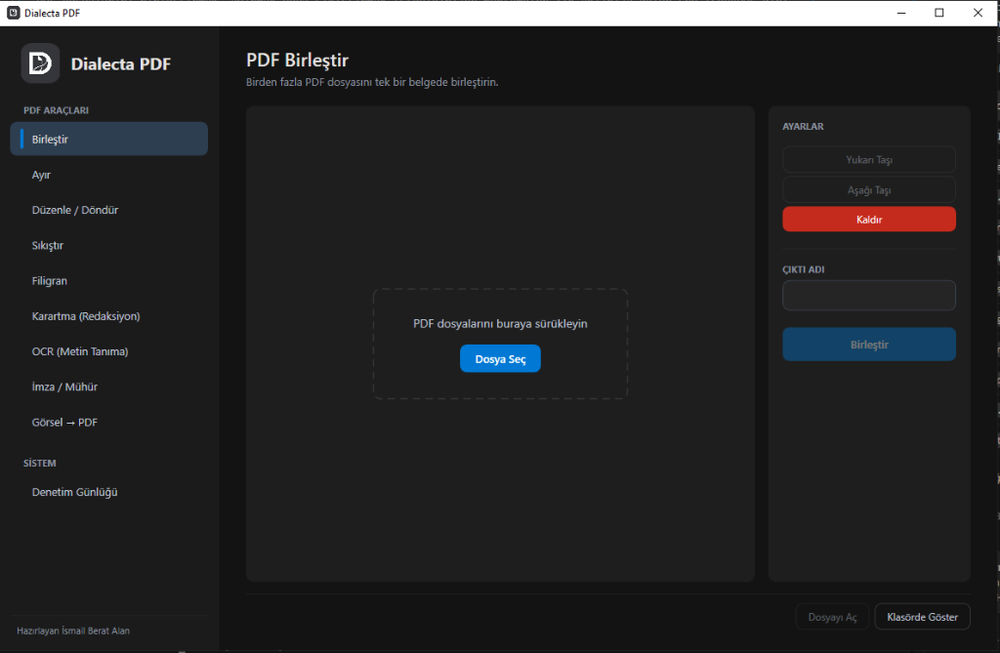
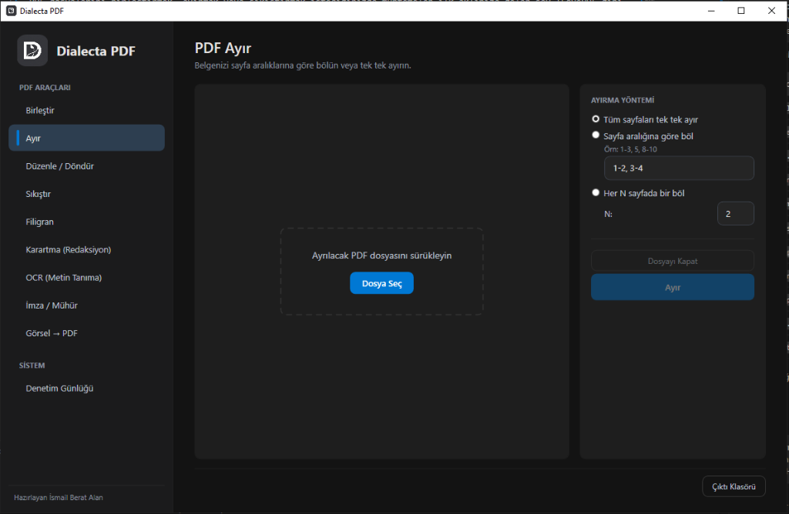
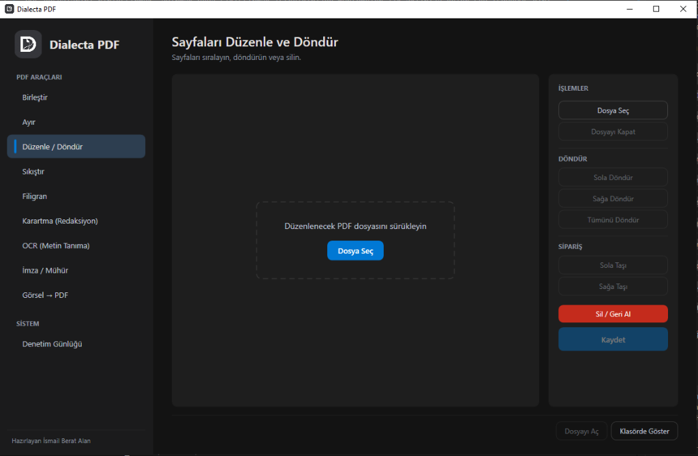
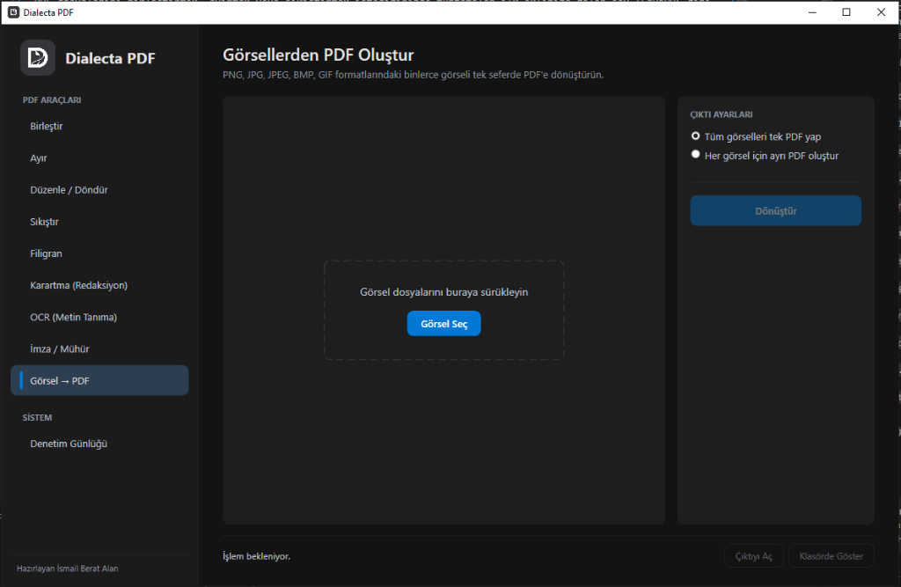
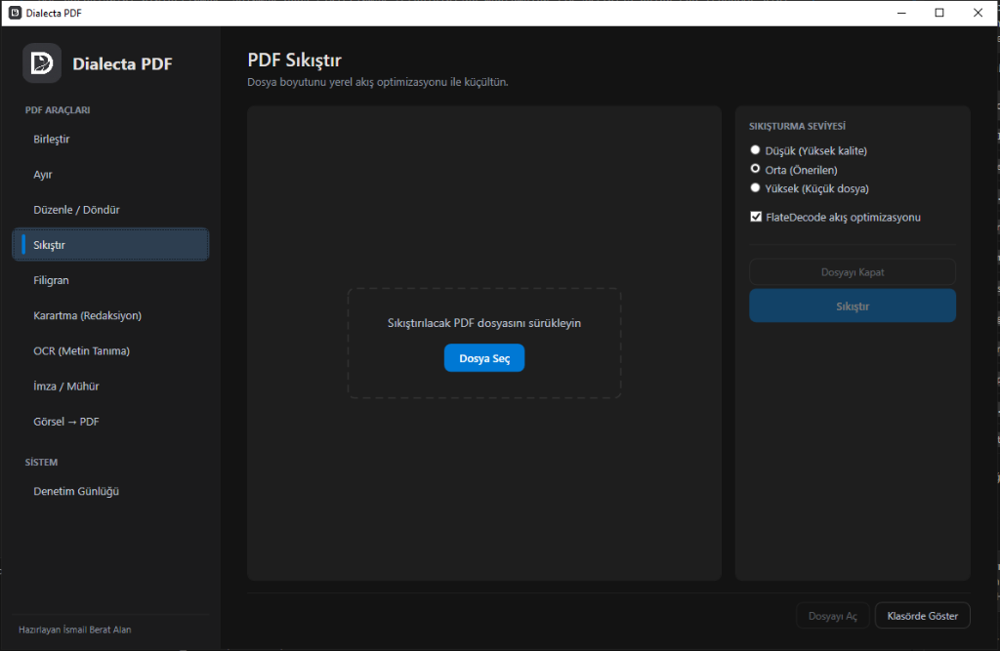
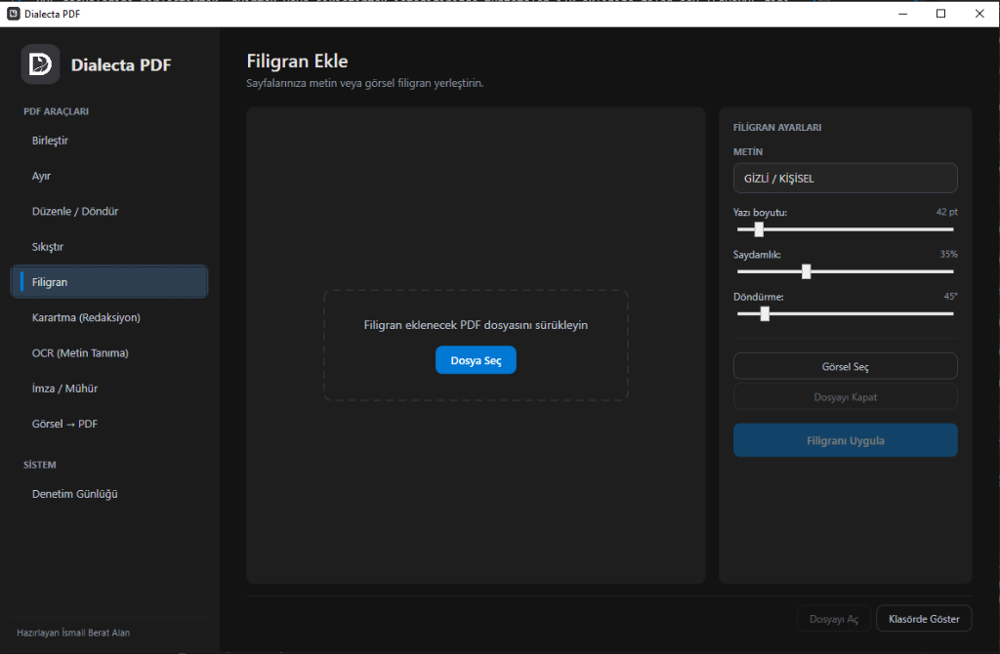
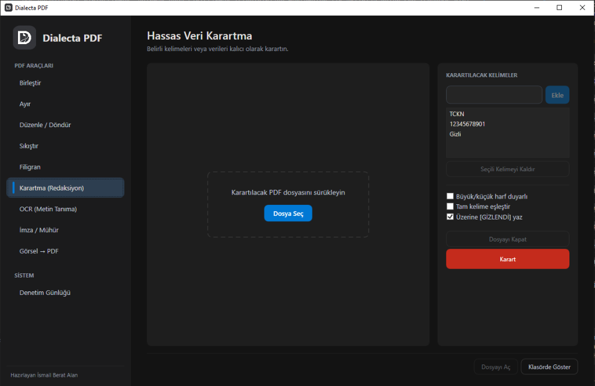
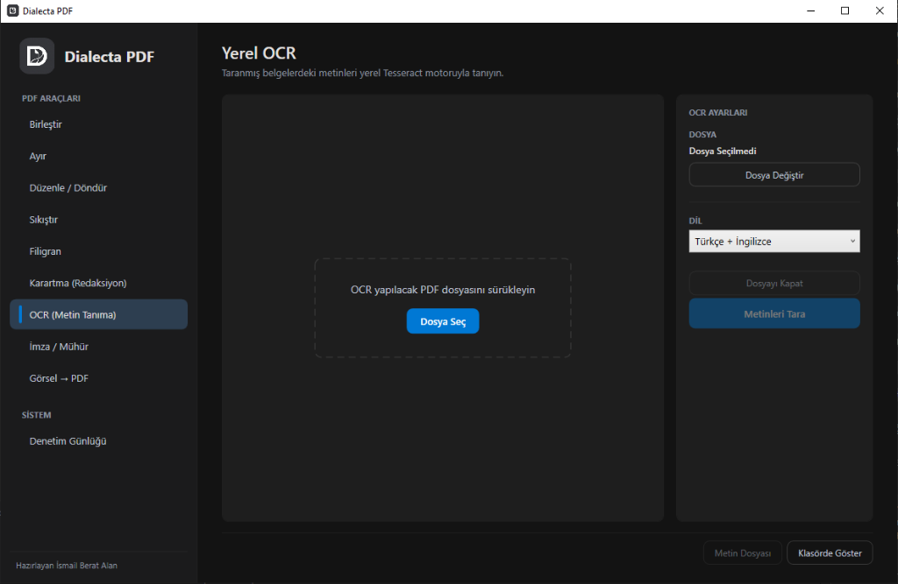
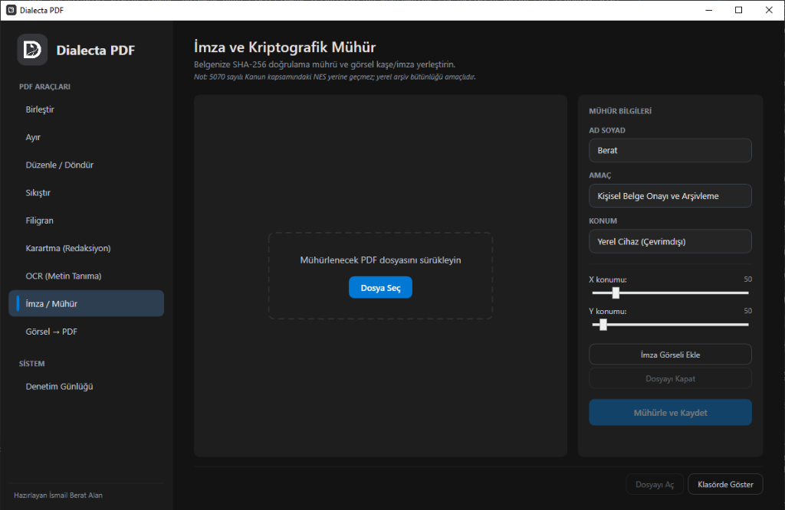
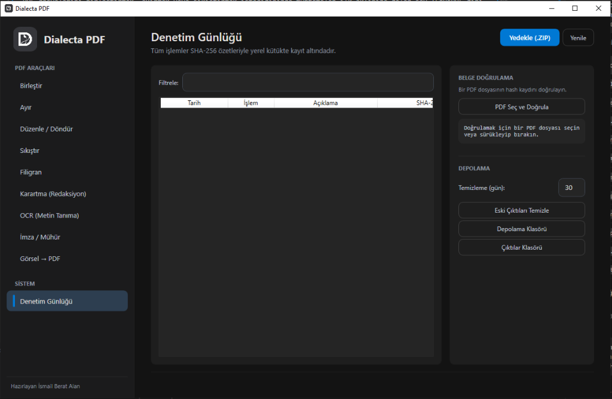

# Dialecta PDF

PDF dosyalarını birleştirmek, ayırmak veya sıkıştırmak istediğinizde muhtemelen ilk aklınıza gelen şey ILovePDF gibi çevrimiçi araçlar oluyor. Ama bir an durup düşünün: banka ekstrelerinizi, kimlik fotokopilerinizi veya şirket sözleşmelerinizi gerçekten tanımadığınız bir sunucuya yüklemek ister misiniz?

Dialecta PDF bu soruya "hayır" diyenler için yazıldı. Tamamen çevrimdışı çalışan, dosyalarınızı hiçbir sunucuya göndermeyen, ücretsiz ve açık kaynaklı bir Windows masaüstü uygulamasıdır. Kurulum bile gerektirmez; tek bir `.exe` dosyasını çalıştırmanız yeterli.

Kaynak kodun tamamı bu depoda yer alıyor. Arka planda ne döndüğünü merak ediyorsanız kendiniz inceleyebilir, fork'layabilir veya katkıda bulunabilirsiniz.

---

## Nasıl kullanırım?

Uygulamayı kullanmak için herhangi bir kurulum yapmanıza gerek yok. Bu sayfanın sağ tarafındaki **Releases** bölümünden en güncel sürümü `.zip` olarak indirin, arşivi açın ve içindeki `DialectaPDF.exe` dosyasını çalıştırın. Hepsi bu kadar.

Eğer kaynak koddan kendiniz derlemek isterseniz, sayfanın alt kısmındaki [Kurulum ve derleme](#kurulum-ve-derleme) bölümüne bakabilirsiniz.

---

## Ne yapabilirsiniz?

### PDF Birleştirme
Birden fazla PDF dosyasını sürükleyip bırakarak istediğiniz sırayla tek bir belgede birleştirin.



### PDF Ayırma
Bir belgeyi sayfa aralıklarına göre parçalara bölün ya da her sayfayı ayrı bir dosya olarak kaydedin.



### Sayfa Düzenleme ve Döndürme
Sayfaları görsel ızgara üzerinde sürükleyerek yeniden sıralayın, döndürün veya istemediğiniz sayfaları çıkarın.



### Görüntüden PDF Oluşturma
JPEG veya PNG dosyalarınızı seçin, tek tıkla PDF'e dönüştürün.



### PDF Sıkıştırma
Dosya boyutunu düşük, orta veya yüksek sıkıştırma seviyeleriyle küçültün. E-postayla gönderilemeyecek kadar büyük belgeler için ideal.



### Filigran Ekleme
Sayfalarınıza metin veya logo filigranı ekleyin. Saydamlık, açı ve konum ayarlarını kendiniz belirleyin.



### Hassas Veri Karartma
TCKN, telefon numarası veya istediğiniz herhangi bir anahtar kelimeyi belgede kalıcı olarak karartın. Karartılan veriler geri getirilemez.



### Yerel OCR (Metin Tanıma)
Taranmış belgelerden veya görsellerden metin çıkarın. Dahili Tesseract motoru Türkçe ve İngilizce destekler. İnternet bağlantısı gerekmez, her şey bilgisayarınızda işlenir.



### Dijital Mühür ve İmza
Belgelerinize görsel imza veya kaşe ekleyin. Uygulama arka planda SHA-256 özeti oluşturarak belgenin değiştirilip değiştirilmediğini doğrulamanıza olanak tanır.



### Denetim Günlüğü ve Yedekleme
Yaptığınız tüm işlemler zaman damgasıyla birlikte kayıt altına alınır. Tüm verilerinizi tek tıkla ZIP olarak yedekleyebilirsiniz.



---

## Güvenlik ve gizlilik

Uygulamanın güvenlik konusundaki yaklaşımı oldukça basit: hiçbir şey dışarı çıkmaz.

- Hiçbir dış sunucuya bağlanmaz, hiçbir veri göndermez, telemetri toplamaz.
- Orijinal dosyalarınıza dokunmaz. Her işlem yeni bir çıktı dosyası üretir.
- Programı kapattığınızda hiçbir arka plan süreci kalmaz.
- Tüm çıktılar ve kayıtlar yerel `DialectaPDF_Veri` klasöründe saklanır.

> **Not:** Uygulamadaki dijital mühür özelliği kişisel kullanım içindir. 5070 sayılı Elektronik İmza Kanunu kapsamındaki nitelikli e-imza (NES) yerine geçmez.

---

## Kurulum ve derleme

Projeyi klonlayıp terminalden derleyebilirsiniz:

```powershell
dotnet build
```

Tek dosya olarak dağıtmak isterseniz (hedef makinede .NET kurulu olması gerekmez):

```powershell
dotnet publish PdfMaster/PdfMaster.csproj -c Release -r win-x64 --self-contained true -p:PublishSingleFile=true -p:IncludeNativeLibrariesForSelfExtract=true -p:EnableCompressionInSingleFile=true -o ./publish
```

Oluşan `publish/DialectaPDF.exe` dosyasını herhangi bir Windows bilgisayara kopyalayıp çalıştırabilirsiniz.

## Lisans

[GNU General Public License v3.0](LICENSE)
